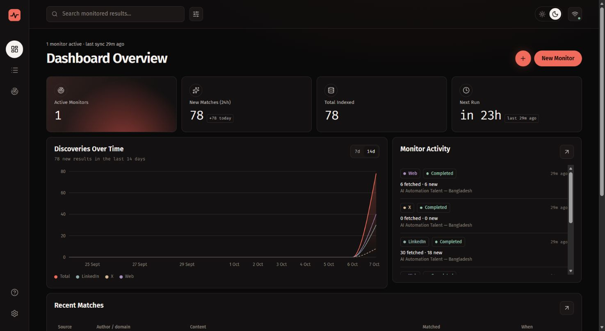

<div align="center">
  

  # Keyword Monitor

  **Track the topics you care about across LinkedIn, X, and the web.**

  A local app that searches on a schedule, checks keyword relevance, removes duplicates, and keeps the results in SQLite. Your data stays on your computer.
</div>



## What it does

- **Set up your own monitors:** choose keywords, sources, result types, an initial lookback, and a schedule.
- **Control matching:** require every concept in a keyword anywhere in the displayed text, or together within 20 words. Common forms such as `AI` / `artificial intelligence` and `Bangladesh` / `Dhaka` count.
- **Curate the feed:** choose jobs, people, news, courses, or other results. Source switches independently control LinkedIn, X, and web search. A separate Web option can exclude social sites from web search.
- **Inspect uncertain matches:** web pages found through search stay visible with a warning when their title and snippet cannot confirm the keyword match.
- **Keep a clean history:** repeated posts and pages are deduplicated; results, run history, and raw provider payloads remain available locally.
- **Use the data elsewhere:** read the local JSON and JSONL exports or the HTTP API.

Keyword Monitor is designed for one person on one machine. It has no account system. Searches use [Apify](https://apify.com/), which requires an API token and charges for Actor usage.

## Get started

### Requirements

- [Node.js](https://nodejs.org/) **24 or newer** and npm
- An [Apify account and API token](https://docs.apify.com/integrations/api#api-token)

### Install and run

Download the repository from GitHub's **Code → Download ZIP** menu and extract it, or clone it with Git. Then run these commands in the project folder:

```sh
npm ci
```

Copy `.env.example` to `.env`. On macOS or Linux, use `cp .env.example .env`; on PowerShell, use `Copy-Item .env.example .env`. Set your token in the new file:

```dotenv
APIFY_API_TOKEN=your_token_here
```

Start the app:

```sh
npm start
```

Open **http://127.0.0.1:4317**. `npm start` builds the frontend and runs the API and scheduler in one local process. Keep that process running for scheduled searches. The first search starts when you save an active monitor; **each run uses Apify credit**.

For development, `npm run dev` starts the API on port 4317 and the Vite frontend on **http://localhost:5173**. Other available commands are `npm run build`, `npm run typecheck`, and `npm test`.

### Make your first monitor

1. Open **New monitor** and give it a name.
2. Add one or more keywords. Each phrase is a separate search; for example, `AI developer Bangladesh` means all three concepts must appear for a verified match.
3. Pick the sources and result types you want. If you want web pages without social sites, turn on **Exclude social sites from Web results**.
4. Choose **Anywhere in result** or **Within 20 words**, then set the lookback and frequency. Review the weekly cost estimate and select your Apify plan.
5. Save. Watch its run status and browse the results. Use **Run now** whenever you want another search.

Choose a small first run: more keywords, sources, and frequent checks increase cost. The minimum interval is 15 minutes. You can pause or edit a monitor later.

## How matching works

The app checks each result's stored title and text against its keyword. Every concept in a keyword must be present, in any order; a few common word and location variants are accepted. **Anywhere** allows the concepts throughout that text. **Within 20 words** requires them together in a 20 word window. LinkedIn and X results that fail the chosen rule are excluded. Web search may match text beyond the short title and snippet returned by the provider, so uncertain web results remain visible with a warning.

Result types are inferred from the returned text. They help curate a feed, but classification can be imperfect. All five types are selected by default. You can change the selection for existing results without spending Apify credit. The source and result type controls apply to each monitor; the Results page has its own filters for browsing stored data.

When **Exclude social sites from Web results** is on, web queries omit Facebook, Instagram, Reddit, LinkedIn, X/Twitter, Threads, TikTok, YouTube, and Pinterest, and previously stored web results from those sites are hidden from that monitor's feed. This option does not switch off the separate LinkedIn or X sources. Changing it does not require another paid run to update the feed.

## Costs and provider behavior

The creation form estimates weekly Actor charges from your keyword count, sources, schedule, item cap, and selected Apify plan. It links the Actors' current rate cards. **It is an estimate, not a spending cap.** Returned items, empty searches, and provider price changes can change the bill; X bills platform usage separately. Review your Apify billing page and [provider notes](PROVIDERS.md) before setting a frequent schedule. `MAX_ITEMS_PER_KEYWORD` controls the per-keyword cap; source Actor IDs can also be overridden with environment variables.

See [.env.example](.env.example) for settings. Restart the server after changing `.env` because it is read at startup. The app listens on loopback (`127.0.0.1`) and has no remote login or multi-user permissions.

## Your data

The default data folder is `data/` and can be moved with `DATA_DIR`. It contains:

| Path | Contents |
| --- | --- |
| `data/monitor.db` | SQLite database with monitors, results, run history, associations, and raw payloads |
| `data/export/results.jsonl` | One canonical result per line |
| `data/export/monitors.json` | Monitor definitions |
| `data/export/runs.jsonl` | Run history |

The equivalent live endpoints are `/api/results`, `/api/monitors`, `/api/runs`, and `/api/export/*`. The API contract is in [server/types.ts](server/types.ts). Deleting a monitor keeps its result history while removing that monitor's association. The database, exports, and `.env` are ignored by Git. Back up the data folder if you want to preserve your history across machines.

## Project map

| Location | Purpose |
| --- | --- |
| `web/` | React interface |
| `server/api.ts` | Local HTTP API |
| `server/runner.ts`, `server/scheduler.ts` | Searches and scheduling |
| `server/providers/` | Apify source adapters |
| `server/match.ts`, `server/dedupe.ts` | Relevance checks and duplicate handling |
| `server/db.ts` | SQLite storage and exports |

For contributors and coding agents, start with [CONTRIBUTING.md](CONTRIBUTING.md) and [AGENTS.md](AGENTS.md). Design context is in [PRODUCT.md](PRODUCT.md) and [DESIGN.md](DESIGN.md).

## Troubleshooting

| Symptom | What to check |
| --- | --- |
| Apify is not configured or the token is invalid | Set `APIFY_API_TOKEN` in `.env` and restart the server. |
| A source failed | Check Settings or run history for its error. Existing results stay stored; retry with **Run now**. |
| A run is throttled | Check your Apify usage and the retry time shown in the app. |
| Few X matches | X searches can be restrictive with long phrases. Try shorter, focused keywords. |
| Port 4317 is in use | Set `PORT` in `.env`, then restart. |

## Community

Contributions are welcome; see [CONTRIBUTING.md](CONTRIBUTING.md). Report sensitive issues using [SECURITY.md](SECURITY.md), and follow the [code of conduct](CODE_OF_CONDUCT.md). See [LICENSE](LICENSE) for reuse terms.
