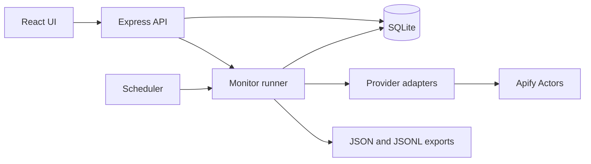

# Architecture

Keyword Monitor runs as a local Node.js server plus a React UI. Express serves the built UI and API on `127.0.0.1:4317`. During development, Vite serves the UI on port 5173 and proxies API requests to Express.

## Main files

| Area | Location | Responsibility |
| --- | --- | --- |
| App entry | `server/index.ts` | Load `.env`, open SQLite, start scheduler and HTTP server. |
| HTTP API | `server/api.ts` | Validate requests; expose monitors, results, runs, stats, raw payloads, and exports. |
| Contract | `server/types.ts` | Shared API types used by server and UI. |
| Storage | `server/db.ts` | SQLite schema, migrations, and read queries. |
| Scheduler | `server/scheduler.ts` | Start due monitors and repair interrupted runs after restart. |
| Run pipeline | `server/runner.ts` | Search selected sources, record runs, filter matches, ingest results, write exports. |
| Matching | `server/match.ts` | Verify keyword concepts in visible result text, including common variants. |
| Ingest and identity | `server/ingest.ts`, `server/dedupe.ts` | Normalize, merge, and deduplicate results. |
| Sources | `server/providers/` | Build Apify queries and map Actor output to shared result items. |
| UI | `web/src/` | React pages, monitor form, API client, and styles. |

## Search lifecycle

Creating an active monitor sets its next run to the current time. The scheduler checks for due monitors about every 30 seconds. A manual run uses the same pipeline. Each selected source creates a separate run row; the X adapter may start one Actor run per keyword because its results do not identify the matched query.

Providers return normalized items. Matching checks all words in each keyword against the visible title and content, allowing supported variants such as `AI` and `artificial intelligence`. A monitor chooses whether the words may appear anywhere or within a 20 word span. LinkedIn and X items without a verified match are excluded. A Web search can match page text beyond its title and snippet, so those results can remain with an unverified warning. Content type selection uses heuristics to filter the feed and does not trigger another paid search. A separate per-monitor Web setting adds exclusions for common social domains to Web queries and hides stored Web results from those domains in that monitor's feed; it does not disable the separately selected LinkedIn or X sources.

Ingest merges repeated keyword and monitor associations. Result IDs derive from stable dedupe keys. The first run uses the selected lookback; later runs use the last successful run with a one hour overlap to catch late arrivals. The overlap can fetch duplicates, which still cost provider work. Pausing a monitor removes its next scheduled time. Deleting one removes its association from results but keeps stored results and run history.

## Storage and exports

The default `DATA_DIR` is `./data`. SQLite stores `monitors`, `results`, `result_monitors`, `raw_payloads`, and `runs` in `monitor.db`. `server/db.ts` applies additive schema migrations when opening an older database. Raw provider payloads are retained for inspection or reprocessing. Exports in `data/export/` are rewritten after runs; the API can also stream them on demand.

The app is local and single user. There is no account system or access control. The HTTP server binds to `127.0.0.1`, and the Apify token stays in the server environment. Do not expose the server publicly without authentication and access controls.

## Changing a source

Each provider follows `server/providers/types.ts`. Its adapter owns Actor input, output mapping, and source specific date handling. `server/providers/index.ts` registers the three providers. To replace an Actor with the same input/output shape, set its environment variable. For a different shape, update its adapter and captured fixture under `server/providers/__fixtures__/`. See [PROVIDERS.md](../PROVIDERS.md).
